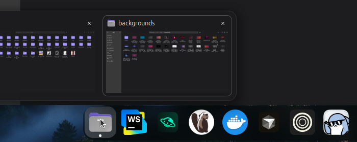
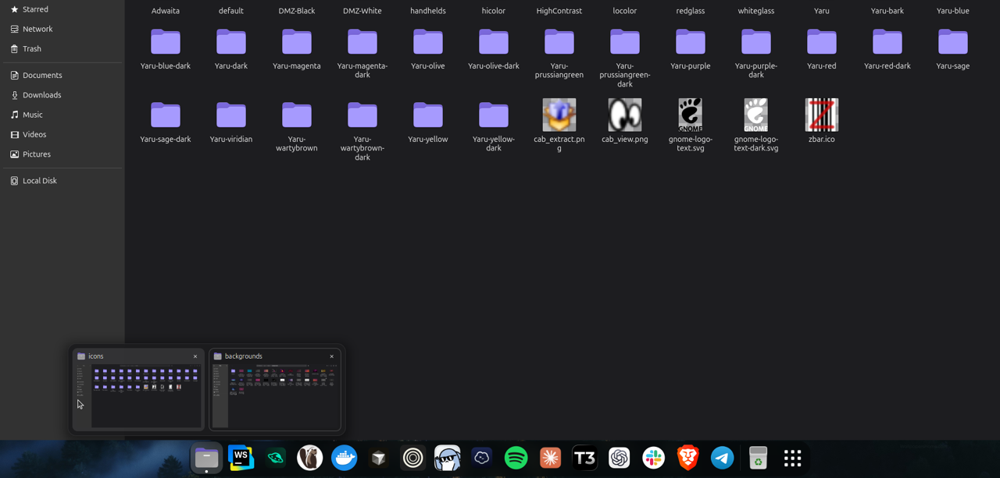
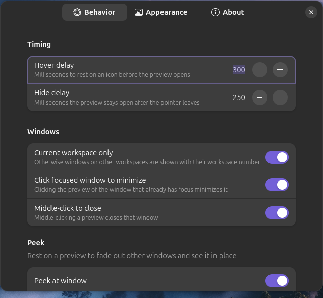

# Dock Hover Preview

Live window previews for the GNOME dock. Hover a running app's icon and see
thumbnails of its open windows, like the taskbar previews on Windows and
macOS.



Works with the built-in GNOME dash, **Ubuntu Dock** and **Dash to Dock**. It
uses only GNOME Shell's own APIs and doesn't depend on any other extension.

## Features

- **Live thumbnails** that keep updating while the preview is open
- **Click** a thumbnail to switch to that window, or click the focused
  window's thumbnail to minimize it
- **Close** windows with the × button or a middle-click
- **Peek**: rest on a thumbnail to fade out the other windows and see that
  one in place
- App icon, window title and a highlight on the focused window
- Workspace number on windows from other workspaces (when showing all
  workspaces)
- Works with the dock on any screen edge, and keeps an auto-hiding dock
  visible while you use the preview
- Many windows shrink to fit the screen, and minimized windows are dimmed



## Requirements

- GNOME Shell 50

## Installation

### From extensions.gnome.org

Install it from [extensions.gnome.org](https://extensions.gnome.org) by
searching for **Dock Hover Preview**.

### From source

```bash
git clone https://github.com/kaleabcodes/dock-hover-preview.git
cd dock-hover-preview
./install.sh
```

Log out and back in (on Wayland, GNOME only loads new extensions at login),
then enable it:

```bash
gnome-extensions enable dock-hover-preview@kaleabcodes.dev
```

## Settings

Open the settings from the Extensions app, or run:

```bash
gnome-extensions prefs dock-hover-preview@kaleabcodes.dev
```



| Page | Setting | Default |
| --- | --- | --- |
| Behavior | Hover delay | 300 ms |
| | Hide delay | 250 ms |
| | Current workspace only | On |
| | Click focused window to minimize | On |
| | Middle-click to close | On |
| | Peek at window | On |
| | Peek delay | 700 ms |
| Appearance | Preview width | 240 px |
| | Show window titles, app icon, close button | On |
| | Background opacity | 94 % |
| | Animation duration (0 turns animations off) | 150 ms |

The Appearance page also has a **Reset All Settings** button.

## Development

The project layout:

| File | Purpose |
| --- | --- |
| `extension.js` | Decides when to open and close the preview and peek, and which windows to show |
| `iconTracker.js` | Detects which dock icon the pointer is over |
| `previewPopup.js` | The popup: layout, placement next to the icon, animations |
| `windowCard.js` | One window card: header, live thumbnail, click handling |
| `windowPeek.js` | Fades other windows out and back in for peek |
| `util.js` | Debug logging and a timer helper |
| `prefs.js` | Settings window |
| `schemas/` | Settings definitions |
| `stylesheet.css` | Popup styling |

`./install.sh` compiles the settings schema and links this folder into
`~/.local/share/gnome-shell/extensions`, so your edits take effect at your
next login.

To test without logging out, run a nested GNOME Shell in a window:

```bash
dbus-run-session gnome-shell --devkit
```

Set `DHP_DEBUG=1` to log hover detection and popup placement:

```bash
DHP_DEBUG=1 dbus-run-session gnome-shell --devkit
```

Watch the shell log with:

```bash
journalctl -f -o cat _COMM=gnome-shell
```

To build the zip for extensions.gnome.org (written to `dist/`):

```bash
./pack.sh          # or ./pack.sh 1.1 to set the version name
```

## Releasing

Pushing a version tag publishes the extension automatically: the
[Release workflow](.github/workflows/release.yml) checks the sources, builds
the zip, uploads it to extensions.gnome.org and creates a GitHub release.

```bash
git tag v1.1
git push origin v1.1
```

You can also run it from the **Actions** tab (Release → Run workflow).

It needs two repository secrets (Settings → Secrets and variables →
Actions): `EGO_USERNAME` and `EGO_PASSWORD`, your extensions.gnome.org login.
Each upload goes through the extensions.gnome.org review before users get it.

## License

[GPL-2.0-or-later](LICENSE)

## Author

Kaleab Tesfaye · [kaleabcodes.dev](https://kaleabcodes.dev) ·
[kaleabcodes@gmail.com](mailto:kaleabcodes@gmail.com)
